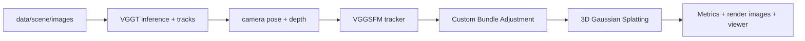

# 计算机视觉期末大作业

刘东琛 2023011040

## 1. 摘要

本项目实现了一个从无标定多视角图像到可交互渲染三维表示的完整重建系统。输入只包含同一场景的多视角图片，不使用给定相机标定。系统首先使用 VGGT 估计相机内参、OpenCV camera-from-world 外参、稀疏 tracks 与初始点云；随后使用自实现 Bundle Adjustment 固定内参并联合优化相机外参和三维点；最后将优化后的重建结果转换到 3D Gaussian Splatting 训练流程，得到可实时渲染的场景表示。

项目同时实现了一个训练-free 的 VGGT 改进方向：一方面从视频中进行质量感知和几何多样性的关键帧选择，另一方面基于 VGGT depth、camera 和 point-map 输出构造稠密初始化点云并进行几何一致性过滤。由于当前决定取消 VGGT tracks 导出阶段的 `max_reproj_error=8.0` 预过滤，所有旧实验指标需要重新运行，报告中以 `[PLACEHOLDER]` 标记待回填指标。

在主 `scene` 场景上，最终需要重新报告自实现 BA 对 VGGT raw 重投影误差和 3DGS 渲染质量的影响：`[PLACEHOLDER: VGGT raw RMSE] -> [PLACEHOLDER: BA RMSE]`，以及 `[PLACEHOLDER: raw 3DGS metrics] -> [PLACEHOLDER: BA 3DGS metrics]`。

## 2. 任务要求与系统设计

本大作业要求在没有相机标定的情况下，使用场景多视角图像完成三维重建和 Gaussian rendering。项目整体Pipeline设计如下：



VGGT 的作用是提供初始几何，包括每张图像的相机参数、稀疏 track 点和 dense depth/point-map 预测。Bundle Adjustment 在 VGGT 输出初值的基础上，在固定内参的前提下优化外参和三维点，从而降低多视角重投影误差。3DGS 的作用是把相机和点云转化为可微渲染的 Gaussian 表示，并通过训练优化颜色、不透明度、尺度和旋转参数，实现实时新视角渲染。三个步骤联合使用使得我们可以从没有任何额外先验信息的情况下对场景结构进行初步重建。

## 3. 统一重建表示与评价指标

本项目的三个核心阶段分别来自不同技术路线：VGGT 是前馈神经网络，BA 是几何优化，3DGS 是可微渲染训练。为了让这些阶段可以稳定衔接，项目没有让每个阶段各自维护一套临时格式，而是设计了统一的 `Reconstruction` 表示。它的作用不是单纯保存文件，而是把“相机、三维点、多视角观测”这三个重建问题的核心对象固定下来，使后续所有实验都在同一套几何定义下比较。

这个表示主要包含三类信息。第一类是图像和相机：图像名、原始图像尺寸、每张图像的内参和外参。第二类是三维结构：稀疏点坐标、颜色和置信度。第三类是观测图：每条二维观测连接一个相机和一个三维点，形成 BA 和重投影误差计算所需的多视角约束。主要字段如下：

| 字段 | 含义 |
|---|---|
| `image_names` | 图像文件名 |
| `image_size_hw` | 原始图像高宽 |
| `intrinsics` | 每张图像的 `3x3` 相机内参 |
| `extrinsics` | 每张图像的 OpenCV camera-from-world `[R|t]` 外参 |
| `points3d` | 三维点坐标 |
| `points_rgb` | 三维点颜色 |
| `points_conf` | 三维点置信度 |
| `obs_camera_id` | 每条观测对应的相机索引 |
| `obs_point_id` | 每条观测对应的三维点索引 |
| `obs_xy` | 图像平面观测坐标 |
| `obs_conf` | 观测置信度 |

当前坐标约定中，外参为 OpenCV camera-from-world，即三维点先从世界坐标变换到相机坐标：

```text
X_cam = R X_world + t
```

设第 `k` 条观测对应第 `i` 个相机和第 `j` 个三维点，二维观测为 `u_k = (x_k, y_k)`。在第 `i` 个相机中，三维点的相机坐标为：

```text
X_ij^cam = R_i X_j + t_i = (X, Y, Z)^T
```

使用针孔相机内参 `K_i` 投影到图像平面：

```text
u_hat_k = pi(K_i, X_ij^cam)
        = (f_x X / Z + c_x,  f_y Y / Z + c_y)^T
```

单条观测的重投影误差定义为预测投影点和 tracker 观测点之间的像素距离：

```text
e_k = ||u_hat_k - u_k||_2
```

后文反复出现的 RMSE、Median 和 P90 都基于所有有效观测的误差集合 `{e_k}` 计算：

```text
RMSE  = sqrt((1 / N) sum_k e_k^2)
Median = median({e_k})
P90    = percentile_90({e_k})
```

RMSE 对大误差更敏感，适合观察整体几何是否存在明显不一致；Median 反映典型观测误差，受少量离群点影响较小；P90 反映较差的 10% 观测的误差水平，用来判断长尾离群点是否仍然严重。报告中 “VGGT raw RMSE” 表示直接使用 VGGT 初始相机和点云计算的重投影误差；“BA after RMSE” 表示经过 Bundle Adjustment 优化和离群点处理后的重投影误差。

需要强调的是，这些指标都是自监督几何一致性指标，不需要真实相机标定或真实三维点。它们可以评价相机、三维点和 tracks 之间是否互相一致，但不能完全等同于最终视觉质量。因此后文会同时报告重投影误差和 3DGS 渲染指标：前者解释几何是否变好，后者验证这种几何改善是否真正转化为新视角渲染效果。

## 4. VGGT 初始重建

本项目使用 VGGT 作为无标定多视角输入的初始几何估计器。VGGT 原始文献为 Wang 等人在 CVPR 2025 发表的 *VGGT: Visual Geometry Grounded Transformer* [1]。它的核心思想是把同一场景的一组图像作为整体输入，通过 Transformer 聚合跨视角视觉特征，再由不同预测头直接输出相机内外参、深度图、三维点图和点轨迹。与传统 SfM 先匹配、再估计相机、再三角化的逐步流程不同，VGGT 是一个前馈模型，可以在较短时间内给出一个全局一致的初始三维解释，因此适合作为后续 BA 和 3DGS 的起点。

在本项目中，VGGT 不进行训练或微调，只作为 frozen 初始化模块使用。实际流程是：先对输入图像做统一尺度预处理；然后运行 VGGT 得到相机参数、深度和初始三维几何；接着使用 tracker 在若干 query frame 上抽取特征点并预测跨视角 tracks；最后只根据可见帧数和可见性置信度保留观测，不再使用 `max_reproj_error=8.0` 对 BA 输入做预过滤。这样得到的初始结果包含两类信息：一类是每张图像的相机，另一类是由多视角 tracks 支撑的稀疏三维点。后续 BA 和 3DGS 都从这组初始相机与点云开始。

首先展示大作业要求中的两组 human 数据和主 `scene` 数据的 VGGT 初始重建结果。表中的 VGGT raw RMSE、Median 和 P90 使用第 3 节定义的重投影误差计算，用来衡量初始相机、三维点和二维 tracks 之间的几何一致性。

| 数据 | 图像数 | Tracking 设置 | Track 点数 | 观测数 | VGGT raw RMSE | Median | P90 |
|---|---:|---|---:|---:|---:|---:|---:|
| `1-human` | 16 | 1024 pts × 16 query frames | `[PLACEHOLDER]` | `[PLACEHOLDER]` | `[PLACEHOLDER]` | `[PLACEHOLDER]` | `[PLACEHOLDER]` |
| `2-human` | 16 | 1024 pts × 16 query frames | `[PLACEHOLDER]` | `[PLACEHOLDER]` | `[PLACEHOLDER]` | `[PLACEHOLDER]` | `[PLACEHOLDER]` |
| `scene` | 64 | 512 pts × 12 query frames | `[PLACEHOLDER]` | `[PLACEHOLDER]` | `[PLACEHOLDER]` | `[PLACEHOLDER]` | `[PLACEHOLDER]` |

两组 human 数据只有 16 帧，因此可以使用更高的 query point 数量。主 `scene` 数据包含 64 帧，视角覆盖更充分，但显存压力更大，因此使用较低的 512 个 query points。取消重投影预过滤后，raw RMSE 预计会比旧结果更高，更适合体现 BA 对原始 tracker 观测图的鲁棒优化作用。

为了降低显存占用并尝试增加 tracks 密度，我还做过一个 `scene_32` 负结果实验：把主场景从 64 帧抽到 32 帧，使 tracking 阶段可以把 `MAX_QUERY_PTS` 从 512 提高到 768，并把 query frame 数提高到 16。这个设置确实增加了稀疏点数量，raw 重投影 RMSE 也更低，但最终 3DGS 效果反而明显低于 64 帧主实验。

| 设置 | 帧数 | Tracking 设置 | Track 点数 | 观测数 | VGGT raw RMSE | Raw 3DGS PSNR | BA 3DGS PSNR |
|---|---:|---|---:|---:|---:|---:|---:|
| 主 `scene` | 64 | 512 pts × 12 query frames | `[PLACEHOLDER]` | `[PLACEHOLDER]` | `[PLACEHOLDER]` | `[PLACEHOLDER]` | `[PLACEHOLDER]` |
| `scene_32` | 32 | 768 pts × 16 query frames | `[PLACEHOLDER]` | `[PLACEHOLDER]` | `[PLACEHOLDER]` | `[PLACEHOLDER]` | `[PLACEHOLDER]` |

`scene_32` 需要在新设置下重新运行后再判断。预期它仍然用于分析显存、track 密度和视角覆盖之间的权衡，而不是作为主结果。

## 5. 自实现 Bundle Adjustment

Bundle Adjustment 的目标是在多视角观测约束下优化相机外参和三维点，使投影误差最小。当前实现固定 VGGT 内参，优化相机旋转、相机平移和三维点坐标。固定内参可以避免在无标定输入下发生内参尺度漂移。

对第 `i` 个相机和第 `j` 个三维点，投影残差为：

```text
r_ij = project(K_i, R_i, t_i, X_j) - u_ij
```

优化目标为 Huber robust loss 下的加权重投影误差：

```text
min_{R_i,t_i,X_j} sum_{(i,j) in O} rho(||r_ij||_2)
```

实现流程为两阶段：

1. 使用全部观测进行鲁棒 BA。
2. 根据重投影误差剔除离群观测，再进行第二轮优化。

BA 定量结果如下：

| 场景 | 方法 | RMSE before | RMSE after | Median before | Median after | P90 before | P90 after | 移除外点 |
|---|---|---:|---:|---:|---:|---:|---:|---:|
| `scene` | custom BA | `[PLACEHOLDER]` | `[PLACEHOLDER]` | `[PLACEHOLDER]` | `[PLACEHOLDER]` | `[PLACEHOLDER]` | `[PLACEHOLDER]` | `[PLACEHOLDER]` |
| `1-human` | custom BA | `[PLACEHOLDER]` | `[PLACEHOLDER]` | `[PLACEHOLDER]` | `[PLACEHOLDER]` | `[PLACEHOLDER]` | `[PLACEHOLDER]` | `[PLACEHOLDER]` |
| `2-human` | custom BA | `[PLACEHOLDER]` | `[PLACEHOLDER]` | `[PLACEHOLDER]` | `[PLACEHOLDER]` | `[PLACEHOLDER]` | `[PLACEHOLDER]` | `[PLACEHOLDER]` |
| `scene_32` | custom BA | `[PLACEHOLDER]` | `[PLACEHOLDER]` | `[PLACEHOLDER]` | `[PLACEHOLDER]` | `[PLACEHOLDER]` | `[PLACEHOLDER]` | `[PLACEHOLDER]` |

```text
[PLACEHOLDER: 重新生成 BA reprojection error bars]
```

待新实验完成后，根据 RMSE、Median 和 P90 的变化分析 BA 是否稳定改善几何一致性。

## 6. 3D Gaussian Splatting

### 6.1 自实现 3DGS 与 official 3DGS

项目实现了自定义 Gaussian model、renderer wrapper、trainer 和 viewer。自实现版本能够从 `Reconstruction` 初始化高斯，训练并导出 checkpoint，但当前效果弱于 official 3DGS。主要原因可能包括 densification 策略、尺度初始化、学习率调度和 renderer 参数仍未达到成熟实现的稳定性。

在 `scene` 上，自实现 3DGS 使用 BA 后 reconstruction 的最终结果为：

| 方法 | PSNR | SSIM | LPIPS | Gaussian 数 | 训练时间 |
|---|---:|---:|---:|---:|---:|
| custom 3DGS + custom BA | `[PLACEHOLDER]` | `[PLACEHOLDER]` | `[PLACEHOLDER]` | `[PLACEHOLDER]` | `[PLACEHOLDER]` |

因此最终质量展示主要使用 official 3DGS；自实现 3DGS 用于展示工程链路和失败分析。

### 6.2 Human 场景结果

Human 场景的初期效果较差，主要原因是前景人物占图像比例小、绿色背景对指标和初始化点都有影响。后续采用 mask-white 合成，并提升 VGGT/VGGSfM tracks 密度。实验发现，human 结果提升的主要因素是高密度 tracks 和稳定 BA，而不是 mask 本身。

Human 场景 BA 结果：

| 场景 | BA 点数 | 观测数 | RMSE before | RMSE after | P90 before | P90 after |
|---|---:|---:|---:|---:|---:|---:|
| `1-human` | `[PLACEHOLDER]` | `[PLACEHOLDER]` | `[PLACEHOLDER]` | `[PLACEHOLDER]` | `[PLACEHOLDER]` | `[PLACEHOLDER]` |
| `2-human` | `[PLACEHOLDER]` | `[PLACEHOLDER]` | `[PLACEHOLDER]` | `[PLACEHOLDER]` | `[PLACEHOLDER]` | `[PLACEHOLDER]` |

Human 场景 official 3DGS 结果：

| 场景 | Test views | PSNR | SSIM | LPIPS | Run |
|---|---:|---:|---:|---:|---|
| `1-human` | 8 | `[PLACEHOLDER]` | `[PLACEHOLDER]` | `[PLACEHOLDER]` | `[PLACEHOLDER]` |
| `2-human` | 8 | `[PLACEHOLDER]` | `[PLACEHOLDER]` | `[PLACEHOLDER]` | `[PLACEHOLDER]` |

```text
[PLACEHOLDER: 重新生成 Human metrics]
```

```text
[PLACEHOLDER: 重新生成 Human render comparison]
```

### 6.3 Scene 主实验：raw、BA 与 random init

主实验使用 `scene` 场景。对比项包括 VGGT raw sparse 初始化、custom BA sparse 初始化，以及 random point init 下 raw camera 和 BA camera 的效果。random init 对比用于区分“点云初始化质量”和“相机质量”的贡献。

| 方法 | 初始化点 | 相机 | PSNR | SSIM | LPIPS | Run |
|---|---|---|---:|---:|---:|---|
| VGGT raw | tracker points | VGGT raw | `[PLACEHOLDER]` | `[PLACEHOLDER]` | `[PLACEHOLDER]` | `[PLACEHOLDER]` |
| custom BA | tracker points | custom BA | `[PLACEHOLDER]` | `[PLACEHOLDER]` | `[PLACEHOLDER]` | `[PLACEHOLDER]` |
| random raw | random points | VGGT raw | `[PLACEHOLDER]` | `[PLACEHOLDER]` | `[PLACEHOLDER]` | `[PLACEHOLDER]` |
| random BA | random points | custom BA | `[PLACEHOLDER]` | `[PLACEHOLDER]` | `[PLACEHOLDER]` | `[PLACEHOLDER]` |

```text
[PLACEHOLDER: 重新生成 Scene core 3DGS metrics]
```

```text
[PLACEHOLDER: 重新生成 Scene render comparison]
```

待重跑后，需要分别比较 tracker point 初始化和 random point init 下 BA camera 的收益，从而判断相机外参质量和点云初始化质量各自的贡献。

## 7. VGGT 改进

本项目的 VGGT 改进受限于硬件条件，不进行 VGGT 训练或微调，而是在 frozen VGGT 的输入和输出构造上进行训练-free 改进。改进包括：

1. 视频关键帧选择：从原始视频中选择更可靠、更多样的 64 帧。
2. Depth-camera 稠密点过滤：使用 VGGT depth + camera unprojection 作为主点源，用 point-map disagreement 和邻近视角 reprojection voting 做几何过滤。

### 7.1 改进实验 I1：视频关键帧选择

视频关键帧选择先对视频帧计算清晰度、曝光、纹理和去重质量分数，再通过 scout VGGT pass 估计 feature centrality 和 pose smoothness。最终使用 reliability、feature diversity 和 temporal coverage 进行 greedy selection。

图像质量分数为：

```text
q_i = 0.35 rank(blur_i) + 0.30 rank(exposure_i)
    + 0.25 rank(texture_i) + 0.10 rank(duplicate_i)
```

VGGT feature centrality 使用候选帧特征的 top-k cosine similarity：

```text
a_i = (1/k) sum_{j in TopK(i)} cos(f_i, f_j)
```

最终可靠性分数为：

```text
r_i = 0.55 rank(a_i) + 0.25 smoothness_i + 0.20 rank(q_i)
```

当前状态：

| 项目 | 状态 |
|---|---|
| selected images | 已生成 |
| selected VGGT cache | 已生成 partial cache |
| final 512-query selected sparse tracks | `[PLACEHOLDER: 当前 GPU 显存不足，待重跑]` |
| selected custom BA | `[PLACEHOLDER: 依赖 selected sparse reconstruction]` |
| selected sparse official 3DGS | `[PLACEHOLDER: 依赖 selected sparse / BA reconstruction]` |

重要约束：final selected sparse 实验应保持与 uniform baseline 一致的 `MAX_QUERY_PTS=512`、`IMAGE_RESOLUTION=448` 和 `fine_tracking=true`。一次降低到 256 的运行只作为 debug artifact，不进入最终结论。

### 7.2 改进实验 I2：Depth-Camera 稠密点过滤

VGGT 同时输出 depth/camera 和 direct point map。当前方法不直接把 point map 作为主点源，而是使用 depth + camera unprojection 构造三维点：

```text
X_cam(u) = [(x - c_x)D(u)/f_x, (y - c_y)D(u)/f_y, D(u)]^T
P_depth(u) = R^T (X_cam(u) - t)
```

然后用 point map 作为一致性检查：

```text
E_dp(u) = ||P_depth(u) - P_point(u)||_2 / (||P_depth(u)||_2 + epsilon)
```

保留 `E_dp` 小于场景自适应 percentile threshold 的点。再对 depth-camera 点投影到相邻视角，使用 depth reprojection voting 检查多视图一致性。

正式 Dense Geometry Ablation 应在原始 `data/scene` uniform baseline 下运行。取消重投影预过滤后，需要重新生成对应 run：

```text
[PLACEHOLDER: new dense ablation run]
```

该 run 使用旧 VGGT cache，只能导出不依赖 point map 的两个变体：

| Variant | Finite points | After disagreement | After reprojection | Output points | Mean kept votes | 3DGS PSNR |
|---|---:|---:|---:|---:|---:|---:|
| `depth_only` | `[PLACEHOLDER]` | `[PLACEHOLDER]` | `[PLACEHOLDER]` | `[PLACEHOLDER]` | `[PLACEHOLDER]` | `[PLACEHOLDER]` |
| `reprojection_only` | `[PLACEHOLDER]` | `[PLACEHOLDER]` | `[PLACEHOLDER]` | `[PLACEHOLDER]` | `[PLACEHOLDER]` | `[PLACEHOLDER]` |
| `pointmap_only` | `[PLACEHOLDER]` | `[PLACEHOLDER]` | `[PLACEHOLDER]` | `[PLACEHOLDER]` | `[PLACEHOLDER]` | `[PLACEHOLDER]` |
| `disagreement_only` | `[PLACEHOLDER]` | `[PLACEHOLDER]` | `[PLACEHOLDER]` | `[PLACEHOLDER]` | `[PLACEHOLDER]` | `[PLACEHOLDER]` |
| `filtered_full` | `[PLACEHOLDER]` | `[PLACEHOLDER]` | `[PLACEHOLDER]` | `[PLACEHOLDER]` | `[PLACEHOLDER]` | `[PLACEHOLDER]` |

这些 dense variants 的 `output_points` 设为固定上限 `MAX_DENSE_POINTS=200000`。因此点数相同不是过滤无效，而是过滤后候选点仍远大于 20 万，最终按 confidence 加权采样到固定点数。该实验比较的是固定点数预算下点质量是否改善。

Selected-scene dense runs 也需要在新实验设置下重新整理，不能沿用旧指标。它们只作为实现 sanity check 的候选实验，不作为正式 I2 结论：

| Variant | Scene | PSNR | SSIM | LPIPS |
|---|---|---:|---:|---:|
| `depth_only` | `scene_selected` | `[PLACEHOLDER]` | `[PLACEHOLDER]` | `[PLACEHOLDER]` |
| `pointmap_only` | `scene_selected` | `[PLACEHOLDER]` | `[PLACEHOLDER]` | `[PLACEHOLDER]` |
| `disagreement_only` | `scene_selected` | `[PLACEHOLDER]` | `[PLACEHOLDER]` | `[PLACEHOLDER]` |
| `reprojection_only` | `scene_selected` | `[PLACEHOLDER]` | `[PLACEHOLDER]` | `[PLACEHOLDER]` |
| `filtered_full` | `scene_selected` | `[PLACEHOLDER]` | `[PLACEHOLDER]` | `[PLACEHOLDER]` |

```text
[PLACEHOLDER: 重新生成 Selected dense metrics]
```

```text
[PLACEHOLDER: 重新生成 Selected dense render comparison]
```

### 7.3 Full Method 效果

最终 full method 应组合 I1 视频关键帧选择和 I2 depth-camera 稠密点过滤，并与 uniform raw / BA baseline 比较：

| 方法 | Frames | Cameras | Init points | BA | PSNR | SSIM | LPIPS | 状态 |
|---|---:|---|---|---|---:|---:|---:|---|
| Uniform + raw sparse | 64 | VGGT raw | sparse tracks | no | `[PLACEHOLDER]` | `[PLACEHOLDER]` | `[PLACEHOLDER]` | rerun |
| Uniform + BA sparse | 64 | custom BA | sparse tracks | yes | `[PLACEHOLDER]` | `[PLACEHOLDER]` | `[PLACEHOLDER]` | rerun |
| Uniform + dense filtered | 64 | VGGT raw | dense filtered | no | `[PLACEHOLDER]` | `[PLACEHOLDER]` | `[PLACEHOLDER]` | pending |
| Selected + raw sparse | 64 | selected VGGT | sparse tracks | no | `[PLACEHOLDER]` | `[PLACEHOLDER]` | `[PLACEHOLDER]` | pending |
| Selected + BA sparse | 64 | selected custom BA | sparse tracks | yes | `[PLACEHOLDER]` | `[PLACEHOLDER]` | `[PLACEHOLDER]` | pending |
| Selected + dense filtered | 64 | selected VGGT | dense filtered | no | `[PLACEHOLDER]` | `[PLACEHOLDER]` | `[PLACEHOLDER]` | pending |

当前不能沿用旧数值下结论。需要在 `MAX_REPROJ_ERROR=0.0` 的新设置下重跑后，再判断 BA 和训练-free dense filtering 的实际收益。

## 8. 实时交互渲染展示

项目提供 custom viewer 和 official 3DGS 输出路径。当前可用于展示的最佳稳定 official 3DGS run 包括：

| 用途 | Run |
|---|---|
| `scene` 主展示 | `[PLACEHOLDER]` |
| `1-human` 展示 | `[PLACEHOLDER]` |
| `2-human` 展示 | `[PLACEHOLDER]` |

Viewer 截图：

```text
[PLACEHOLDER: 插入 official viewer 或 custom viewer 的实时交互渲染截图]
```

## 9. 分析和结论总结

### BA 为什么有效

BA 直接优化多视角重投影误差，使相机外参和三维点更加一致。对 3DGS 来说，相机误差会造成训练时不同视角的监督信号互相冲突，导致高斯位置、尺度和颜色难以收敛。主场景中的定量结论需要在新设置下回填：`[PLACEHOLDER: raw RMSE] -> [PLACEHOLDER: BA RMSE]`，`[PLACEHOLDER: raw PSNR] -> [PLACEHOLDER: BA PSNR]`。

### Random init 现象

Random init 实验说明 BA 的收益不只来自更好的初始化点云。即使不用 VGGT tracker points 初始化，BA camera 仍比 raw camera 获得更好的 3DGS 指标。这说明相机外参准确性本身就是 3DGS 质量的关键因素。

### Human 场景特殊性

Human 场景前景小、背景颜色单一，直接评估容易受背景影响。mask-white 和高密度 tracks 的效果需要在新设置下重新回填：`1-human [PLACEHOLDER]`，`2-human [PLACEHOLDER]`。

### `scene_32` 负结果

`scene_32` 是为了缓解显存压力而做的尝试：将主场景从 64 帧抽到 32 帧后，tracking 可以从 512 query points 提高到 768 query points。该实验需要在取消重投影预过滤后重新运行，再判断更多 tracks 是否能弥补视角覆盖下降。

### Self 3DGS 弱点

自实现 3DGS 已打通训练和 checkpoint 输出，但质量显著弱于 official implementation。后续需要继续改进 densification、opacity reset、learning rate schedule、尺度初始化和 renderer 参数。

### VGGT 改进风险

训练-free filtering 可能提高点质量，也可能因为减少覆盖而损失信息。正式结论必须以原始 `data/scene` 上重新生成的 dense ablation 和 3DGS 指标为准。

## 10. 未来工作

1. 在 GPU 空闲时补全原始 `data/scene` 的 point-head VGGT cache，完成 `pointmap_only / disagreement_only / filtered_full` dense ablation。
2. 对 dense ablation 增加 `50k / 100k / 200k` 点数预算，区分“点质量提升”和“点数上限掩盖差异”。
3. 补全 selected sparse 512-query reconstruction、selected BA 和 selected sparse 3DGS，验证关键帧选择本身是否优于 uniform sampling。
4. 对 custom 3DGS 加强 densification 和学习率策略，使其更接近 official 3DGS。
5. 增加 viewer 截图和答辩 demo 脚本，保证最终展示可复现。

## 参考文献

[1] Jianyuan Wang, Minghao Chen, Nikita Karaev, Andrea Vedaldi, Christian Rupprecht, David Novotny. *VGGT: Visual Geometry Grounded Transformer*. CVPR 2025.
