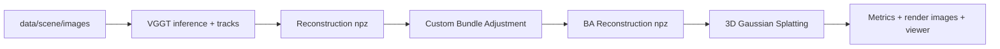
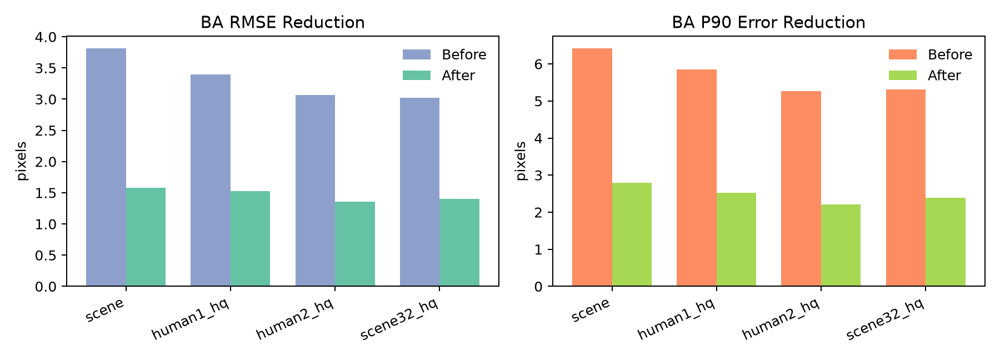
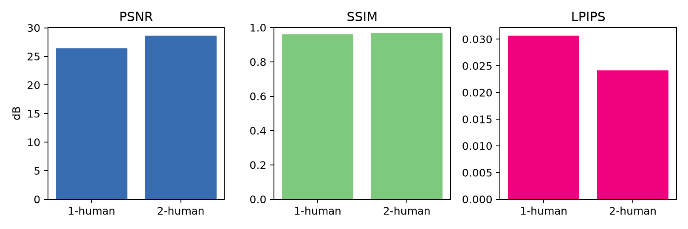
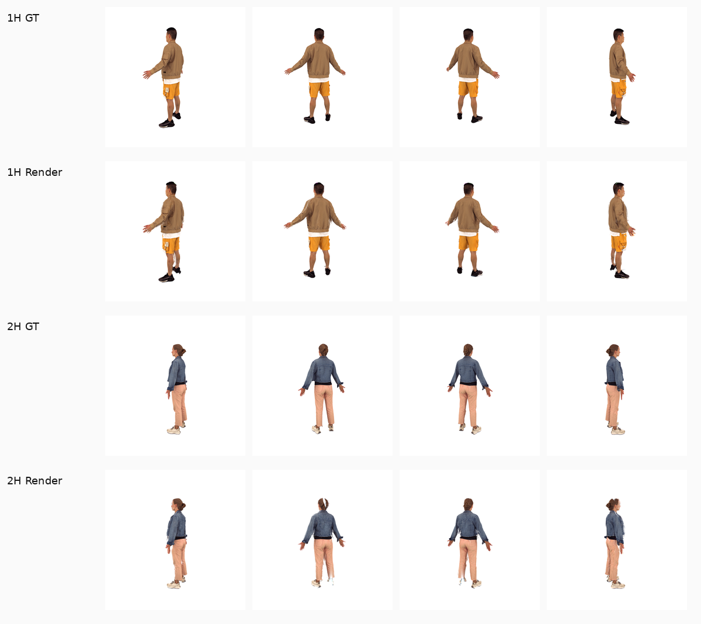
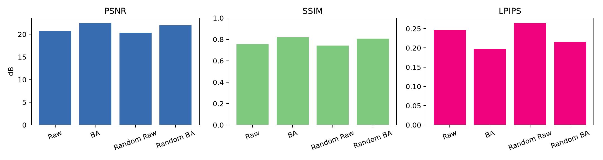
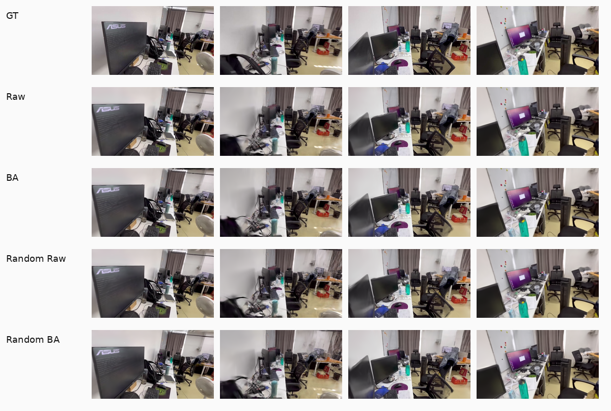
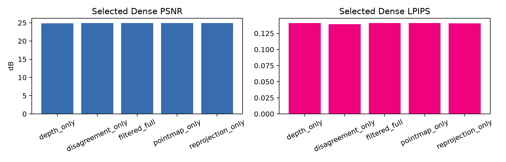
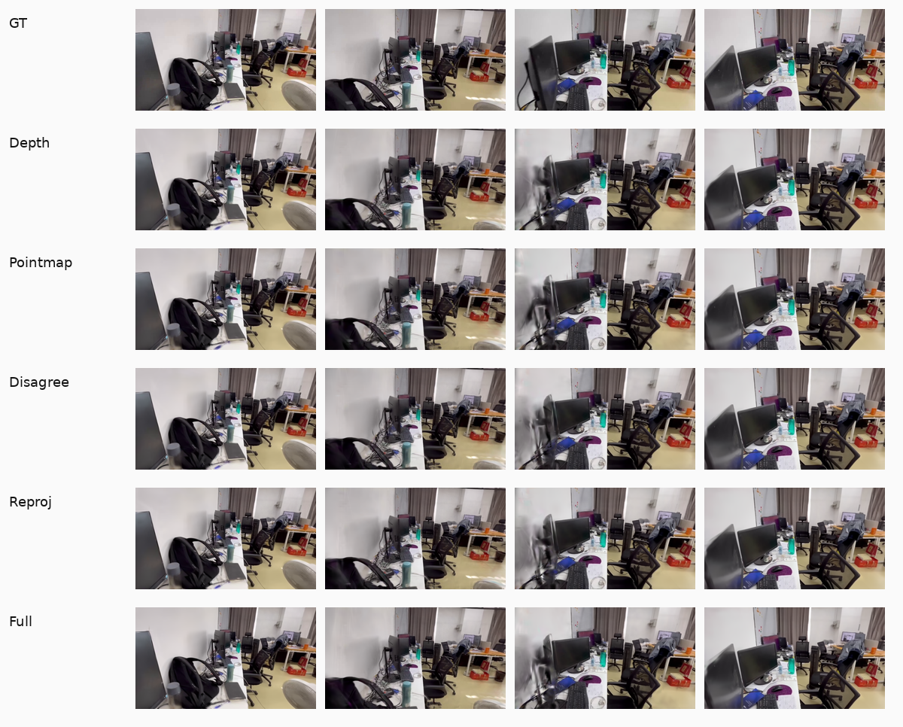

# 基于 VGGT、Bundle Adjustment 与 3D Gaussian Splatting 的多视角三维重建

## 1. 摘要

本项目实现了一个从无标定多视角图像到可交互渲染三维表示的完整重建系统。输入只包含同一场景的多视角图片，不使用给定相机标定。系统首先使用 VGGT 估计相机内参、OpenCV camera-from-world 外参、稀疏 tracks 与初始点云；随后使用自实现 Bundle Adjustment 固定内参并联合优化相机外参和三维点；最后将优化后的重建结果转换到 3D Gaussian Splatting 训练流程，得到可实时渲染的场景表示。

项目同时实现了一个训练-free 的 VGGT 改进方向：一方面从视频中进行质量感知和几何多样性的关键帧选择，另一方面基于 VGGT depth、camera 和 point-map 输出构造稠密初始化点云并进行几何一致性过滤。当前 BA 和 3DGS 主实验已经完成；原始 `scene` 场景上的完整 Dense Geometry Ablation 仍受当前共享 GPU 显存条件限制，报告中以 `[PLACEHOLDER]` 标记未完成指标。

在主 `scene` 场景上，自实现 BA 将 VGGT raw 重投影 RMSE 从 `3.82 px` 降到 `1.58 px`，并将 official 3DGS 渲染质量从 `PSNR 20.73 / SSIM 0.754 / LPIPS 0.247` 提升到 `PSNR 22.47 / SSIM 0.820 / LPIPS 0.197`。这说明 BA 对多视角几何一致性和 3DGS 最终渲染质量都有直接贡献。

## 2. 任务要求与系统设计

本大作业要求在没有相机标定的情况下，使用场景多视角图像完成三维重建和 Gaussian rendering。项目系统设计如下：



VGGT 的作用是提供初始几何，包括每张图像的相机参数、稀疏 track 点和 dense depth/point-map 预测。BA 的作用是以 VGGT 输出为初值，在固定内参的前提下优化外参和三维点，从而降低多视角重投影误差。3DGS 的作用是把相机和点云转化为可微渲染的 Gaussian 表示，并通过训练优化颜色、不透明度、尺度和旋转参数，实现实时新视角渲染。

项目中所有主要阶段都通过统一的 `Reconstruction` 数据结构交换结果，避免 VGGT、BA、COLMAP export 和 3DGS wrapper 之间出现阶段特有的临时格式。

## 3. 数据格式与坐标约定

项目定义的核心数据结构为 `src/data/reconstruction.py` 中的 `Reconstruction`。主要字段如下：

| 字段 | 含义 |
|---|---|
| `image_names` | 图像文件名 |
| `image_size_hw` | 原始图像高宽 |
| `intrinsics` | 每张图像的 `3x3` 相机内参 |
| `extrinsics` | 每张图像的 OpenCV camera-from-world `[R|t]` 外参 |
| `points3d` | 三维点坐标 |
| `points_rgb` | 三维点颜色 |
| `points_conf` | 三维点置信度 |
| `obs_camera_id` | 每条观测对应的相机索引 |
| `obs_point_id` | 每条观测对应的三维点索引 |
| `obs_xy` | 图像平面观测坐标 |
| `obs_conf` | 观测置信度 |

BA 使用 `obs_camera_id / obs_point_id / obs_xy / obs_conf` 构成 flat observation graph。当前坐标约定中，外参为 OpenCV camera-from-world：

```text
X_cam = R X_world + t
```

3DGS 和 COLMAP 兼容导出阶段都从该统一格式读取相机、点云和观测，必要时再转换到外部工具所需坐标。

## 4. VGGT 初始重建

VGGT 提供无需预标定相机的初始三维重建能力。项目中的 VGGT export 阶段完成以下工作：

1. 读取多视角图像并 resize 到 VGGT 输入分辨率。
2. 运行 VGGT inference，得到相机、depth、dense point cloud 等预测。
3. 运行 track prediction，得到跨视角稀疏对应点。
4. 根据可见性、最小可见帧数和重投影误差进行过滤。
5. 导出 `reconstruction.npz`、COLMAP sparse、dense PLY 和 summary。

已有 VGGT 初始结果如下：

| 场景 | 图像数 | Track 点数 | 观测数 | VGGT inference | Track prediction | Run |
|---|---:|---:|---:|---:|---:|---|
| `scene` | 64 | 9,760 | 116,725 | 19.68s | 34.12s | `data/scene/vggt_raw/runs/20260627_074913_vggt_export` |
| `1-human` | 16 | 18,183 | 138,917 | - | 40.82s | `data/1-human/vggt_raw_hq_unmasked/runs/20260629_083702_vggt_export` |
| `2-human` | 16 | 17,678 | 143,966 | - | 36.44s | `data/2-human/vggt_raw_hq_unmasked/runs/20260629_084616_vggt_export` |
| `scene_32` | 32 | 16,405 | 109,823 | - | 45.36s | `data/scene_32/vggt_raw_hq_768/runs/20260629_091545_vggt_export` |

VGGT raw 的重投影误差并不直接等于最终渲染质量，但它反映了相机、三维点和观测之间的一致性，是后续 BA 的直接优化目标。

## 5. 自实现 Bundle Adjustment

Bundle Adjustment 的目标是在多视角观测约束下优化相机外参和三维点，使投影误差最小。当前实现固定 VGGT 内参，优化相机旋转、相机平移和三维点坐标。固定内参可以避免在无标定输入下发生内参尺度漂移。

对第 `i` 个相机和第 `j` 个三维点，投影残差为：

```text
r_ij = project(K_i, R_i, t_i, X_j) - u_ij
```

优化目标为 Huber robust loss 下的加权重投影误差：

```text
min_{R_i,t_i,X_j} sum_{(i,j) in O} rho(||r_ij||_2)
```

实现流程为两阶段：

1. 使用全部观测进行鲁棒 BA。
2. 根据重投影误差剔除离群观测，再进行第二轮优化。

BA 定量结果如下：

| 场景 | 方法 | RMSE before | RMSE after | Median before | Median after | P90 before | P90 after | 移除外点 | 时间 |
|---|---|---:|---:|---:|---:|---:|---:|---:|---:|
| `scene` | custom BA | 3.816 | 1.577 | 2.801 | 0.792 | 6.423 | 2.788 | 4,280 | 122.1s |
| `1-human` | custom BA | 3.394 | 1.529 | 2.305 | 0.939 | 5.855 | 2.524 | 1,616 | 195.6s |
| `2-human` | custom BA | 3.066 | 1.357 | 1.971 | 0.806 | 5.268 | 2.213 | 1,225 | 153.0s |
| `scene_32` | custom BA | 3.024 | 1.404 | 1.800 | 0.716 | 5.314 | 2.390 | 2,535 | 214.2s |



结果显示，自实现 BA 在所有已完成场景中都显著降低了 RMSE、median 和 P90 重投影误差，能够稳定改善几何一致性。

## 6. 3D Gaussian Splatting

### 6.1 自实现 3DGS 与 official 3DGS

项目实现了自定义 Gaussian model、renderer wrapper、trainer 和 viewer。自实现版本能够从 `Reconstruction` 初始化高斯，训练并导出 checkpoint，但当前效果弱于 official 3DGS。主要原因可能包括 densification 策略、尺度初始化、学习率调度和 renderer 参数仍未达到成熟实现的稳定性。

在 `scene` 上，自实现 3DGS 使用 BA 后 reconstruction 的最终结果为：

| 方法 | PSNR | SSIM | LPIPS | Gaussian 数 | 训练时间 |
|---|---:|---:|---:|---:|---:|
| custom 3DGS + custom BA | 16.399 | 0.570 | - | 100,619 | 126.2s |

因此最终质量展示主要使用 official 3DGS；自实现 3DGS 用于展示工程链路和失败分析。

### 6.2 Human 场景结果

Human 场景的初期效果较差，主要原因是前景人物占图像比例小、绿色背景对指标和初始化点都有影响。后续采用 mask-white 合成，并提升 VGGT/VGGSfM tracks 密度。实验发现，human 结果提升的主要因素是高密度 tracks 和稳定 BA，而不是 mask 本身。

Human 场景 BA 结果：

| 场景 | BA 点数 | 观测数 | RMSE before | RMSE after | P90 before | P90 after | BA 时间 |
|---|---:|---:|---:|---:|---:|---:|---:|
| `1-human` | 18,162 | 137,280 | 3.39 | 1.53 | 5.86 | 2.52 | 195.6s |
| `2-human` | 17,677 | 142,740 | 3.07 | 1.36 | 5.27 | 2.21 | 153.0s |

Human 场景 official 3DGS 结果：

| 场景 | Test views | PSNR | SSIM | LPIPS | Run |
|---|---:|---:|---:|---:|---|
| `1-human` | 8 | 26.435 | 0.959 | 0.031 | `data/1-human/gs_official_ba_hq_masked/runs/20260629_084243_gaussian_official` |
| `2-human` | 8 | 28.624 | 0.968 | 0.024 | `data/2-human/gs_official_ba_hq_masked/runs/20260629_085004_gaussian_official` |





### 6.3 Scene 主实验：raw、BA 与 random init

主实验使用 `scene` 场景。对比项包括 VGGT raw sparse 初始化、custom BA sparse 初始化，以及 random point init 下 raw camera 和 BA camera 的效果。random init 对比用于区分“点云初始化质量”和“相机质量”的贡献。

| 方法 | 初始化点 | 相机 | PSNR | SSIM | LPIPS | Run |
|---|---|---|---:|---:|---:|---|
| VGGT raw | tracker points | VGGT raw | 20.729 | 0.754 | 0.247 | `data/scene/gs_official_raw/runs/20260627_135803_gaussian_official` |
| custom BA | tracker points | custom BA | 22.471 | 0.820 | 0.197 | `data/scene/gs_official_ba/runs/20260627_133737_gaussian_official` |
| random raw | random points | VGGT raw | 20.317 | 0.742 | 0.264 | `data/scene/gs_official_random_raw/runs/20260627_141252_gaussian_official` |
| random BA | random points | custom BA | 21.983 | 0.806 | 0.215 | `data/scene/gs_official_random_ba/runs/20260627_140637_gaussian_official` |





BA 在 tracker point 初始化下带来 `+1.74 dB` PSNR 提升；即使使用 random point init，BA camera 仍比 raw camera 高 `+1.67 dB`。这说明相机外参质量是 3DGS 效果的核心因素之一，点云初始化并不是唯一决定因素。

## 7. VGGT 改进

本项目的 VGGT 改进受限于硬件条件，不进行 VGGT 训练或微调，而是在 frozen VGGT 的输入和输出构造上进行训练-free 改进。改进包括：

1. 视频关键帧选择：从原始视频中选择更可靠、更多样的 64 帧。
2. Depth-camera 稠密点过滤：使用 VGGT depth + camera unprojection 作为主点源，用 point-map disagreement 和邻近视角 reprojection voting 做几何过滤。

### 7.1 改进实验 I1：视频关键帧选择

视频关键帧选择先对视频帧计算清晰度、曝光、纹理和去重质量分数，再通过 scout VGGT pass 估计 feature centrality 和 pose smoothness。最终使用 reliability、feature diversity 和 temporal coverage 进行 greedy selection。

图像质量分数为：

```text
q_i = 0.35 rank(blur_i) + 0.30 rank(exposure_i)
    + 0.25 rank(texture_i) + 0.10 rank(duplicate_i)
```

VGGT feature centrality 使用候选帧特征的 top-k cosine similarity：

```text
a_i = (1/k) sum_{j in TopK(i)} cos(f_i, f_j)
```

最终可靠性分数为：

```text
r_i = 0.55 rank(a_i) + 0.25 smoothness_i + 0.20 rank(q_i)
```

当前状态：

| 项目 | 状态 |
|---|---|
| selected images | 已生成 |
| selected VGGT cache | 已生成 partial cache |
| final 512-query selected sparse tracks | `[PLACEHOLDER: 当前 GPU 显存不足，待重跑]` |
| selected custom BA | `[PLACEHOLDER: 依赖 selected sparse reconstruction]` |
| selected sparse official 3DGS | `[PLACEHOLDER: 依赖 selected sparse / BA reconstruction]` |

重要约束：final selected sparse 实验应保持与 uniform baseline 一致的 `MAX_QUERY_PTS=512`、`IMAGE_RESOLUTION=448` 和 `fine_tracking=true`。一次降低到 256 的运行只作为 debug artifact，不进入最终结论。

### 7.2 改进实验 I2：Depth-Camera 稠密点过滤

VGGT 同时输出 depth/camera 和 direct point map。当前方法不直接把 point map 作为主点源，而是使用 depth + camera unprojection 构造三维点：

```text
X_cam(u) = [(x - c_x)D(u)/f_x, (y - c_y)D(u)/f_y, D(u)]^T
P_depth(u) = R^T (X_cam(u) - t)
```

然后用 point map 作为一致性检查：

```text
E_dp(u) = ||P_depth(u) - P_point(u)||_2 / (||P_depth(u)||_2 + epsilon)
```

保留 `E_dp` 小于场景自适应 percentile threshold 的点。再对 depth-camera 点投影到相邻视角，使用 depth reprojection voting 检查多视图一致性。

正式 Dense Geometry Ablation 应在原始 `data/scene` uniform baseline 下运行。当前已完成的原始 scene partial export 为：

```text
data/scene/vggt_dense_ablation_scene_200k/runs/20260630_025655_vggt_export
```

该 run 使用旧 VGGT cache，只能导出不依赖 point map 的两个变体：

| Variant | Finite points | After disagreement | After reprojection | Output points | Mean kept votes | 3DGS PSNR |
|---|---:|---:|---:|---:|---:|---:|
| `depth_only` | 17,172,736 | 17,172,736 | 17,172,736 | 200,000 | 0.000 | `[PLACEHOLDER]` |
| `reprojection_only` | 17,172,736 | 17,172,736 | 14,092,514 | 200,000 | 2.918 | `[PLACEHOLDER]` |
| `pointmap_only` | `[PLACEHOLDER]` | `[PLACEHOLDER]` | `[PLACEHOLDER]` | `[PLACEHOLDER]` | `[PLACEHOLDER]` | `[PLACEHOLDER]` |
| `disagreement_only` | `[PLACEHOLDER]` | `[PLACEHOLDER]` | `[PLACEHOLDER]` | `[PLACEHOLDER]` | `[PLACEHOLDER]` | `[PLACEHOLDER]` |
| `filtered_full` | `[PLACEHOLDER]` | `[PLACEHOLDER]` | `[PLACEHOLDER]` | `[PLACEHOLDER]` | `[PLACEHOLDER]` | `[PLACEHOLDER]` |

这些 dense variants 的 `output_points` 设为固定上限 `MAX_DENSE_POINTS=200000`。因此点数相同不是过滤无效，而是过滤后候选点仍远大于 20 万，最终按 confidence 加权采样到固定点数。该实验比较的是固定点数预算下点质量是否改善。

Selected-scene dense runs 已经完成，但不能作为正式 I2 结论，因为其中混入了关键帧选择变量。它们只作为实现 sanity check：

| Variant | Scene | PSNR | SSIM | LPIPS |
|---|---|---:|---:|---:|
| `depth_only` | `scene_selected` | 24.834 | 0.859 | 0.141 |
| `pointmap_only` | `scene_selected` | 24.914 | 0.859 | 0.141 |
| `disagreement_only` | `scene_selected` | 24.953 | 0.860 | 0.139 |
| `reprojection_only` | `scene_selected` | 24.920 | 0.860 | 0.141 |
| `filtered_full` | `scene_selected` | 24.903 | 0.860 | 0.141 |





### 7.3 Full Method 效果

最终 full method 应组合 I1 视频关键帧选择和 I2 depth-camera 稠密点过滤，并与 uniform raw / BA baseline 比较：

| 方法 | Frames | Cameras | Init points | BA | PSNR | SSIM | LPIPS | 状态 |
|---|---:|---|---|---|---:|---:|---:|---|
| Uniform + raw sparse | 64 | VGGT raw | sparse tracks | no | 20.729 | 0.754 | 0.247 | done |
| Uniform + BA sparse | 64 | custom BA | sparse tracks | yes | 22.471 | 0.820 | 0.197 | done |
| Uniform + dense filtered | 64 | VGGT raw | dense filtered | no | `[PLACEHOLDER]` | `[PLACEHOLDER]` | `[PLACEHOLDER]` | pending |
| Selected + raw sparse | 64 | selected VGGT | sparse tracks | no | `[PLACEHOLDER]` | `[PLACEHOLDER]` | `[PLACEHOLDER]` | pending |
| Selected + BA sparse | 64 | selected custom BA | sparse tracks | yes | `[PLACEHOLDER]` | `[PLACEHOLDER]` | `[PLACEHOLDER]` | pending |
| Selected + dense filtered | 64 | selected VGGT | dense filtered | no | 24.903 | 0.860 | 0.141 | support only |

当前可以给出的结论是：BA 的收益已经被主实验充分验证；训练-free dense filtering 的正式结论仍需原始 scene 完整 ablation 完成后填写。

## 8. 实时交互渲染展示

项目提供 custom viewer 和 official 3DGS 输出路径。当前可用于展示的最佳稳定 official 3DGS run 包括：

| 用途 | Run |
|---|---|
| `scene` 主展示 | `data/scene/gs_official_ba/runs/20260627_133737_gaussian_official` |
| `1-human` 展示 | `data/1-human/gs_official_ba_hq_masked/runs/20260629_084243_gaussian_official` |
| `2-human` 展示 | `data/2-human/gs_official_ba_hq_masked/runs/20260629_085004_gaussian_official` |

Viewer 截图：

```text
[PLACEHOLDER: 插入 official viewer 或 custom viewer 的实时交互渲染截图]
```

## 9. 分析和结论总结

### BA 为什么有效

BA 直接优化多视角重投影误差，使相机外参和三维点更加一致。对 3DGS 来说，相机误差会造成训练时不同视角的监督信号互相冲突，导致高斯位置、尺度和颜色难以收敛。主场景中 BA 将 RMSE 从 `3.82 px` 降到 `1.58 px`，并使 PSNR 从 `20.73` 提升到 `22.47`，说明几何一致性提升能够转化为渲染质量提升。

### Random init 现象

Random init 实验说明 BA 的收益不只来自更好的初始化点云。即使不用 VGGT tracker points 初始化，BA camera 仍比 raw camera 获得更好的 3DGS 指标。这说明相机外参准确性本身就是 3DGS 质量的关键因素。

### Human 场景特殊性

Human 场景前景小、背景颜色单一，直接评估容易受背景影响。mask-white 和高密度 tracks 能显著稳定结果。最终 `1-human` 和 `2-human` 分别达到 `PSNR 26.44` 和 `28.62`，可作为答辩中的视觉展示材料。

### `scene_32` 负结果

`scene_32` 使用更高密度 tracks，但帧数减少到 32。结果中 raw HQ 为 `PSNR 18.23`，BA HQ 为 `19.74`，仍低于 64-frame 主场景。这说明更多 tracks 不能替代充分视角覆盖，帧选择必须同时考虑质量、重叠和覆盖。

### Self 3DGS 弱点

自实现 3DGS 已打通训练和 checkpoint 输出，但质量显著弱于 official implementation。后续需要继续改进 densification、opacity reset、learning rate schedule、尺度初始化和 renderer 参数。

### VGGT 改进风险

训练-free filtering 可能提高点质量，也可能因为减少覆盖而损失信息。正式结论必须以原始 `data/scene` 上的 dense ablation 和 3DGS 指标为准。当前 selected-scene dense 结果差异很小，说明在固定 20 万点预算下，selected 场景已经较稳定，不能单独证明过滤方法有效。

## 10. 未来工作

1. 在 GPU 空闲时补全原始 `data/scene` 的 point-head VGGT cache，完成 `pointmap_only / disagreement_only / filtered_full` dense ablation。
2. 对 dense ablation 增加 `50k / 100k / 200k` 点数预算，区分“点质量提升”和“点数上限掩盖差异”。
3. 补全 selected sparse 512-query reconstruction、selected BA 和 selected sparse 3DGS，验证关键帧选择本身是否优于 uniform sampling。
4. 对 custom 3DGS 加强 densification 和学习率策略，使其更接近 official 3DGS。
5. 增加 viewer 截图和答辩 demo 脚本，保证最终展示可复现。
